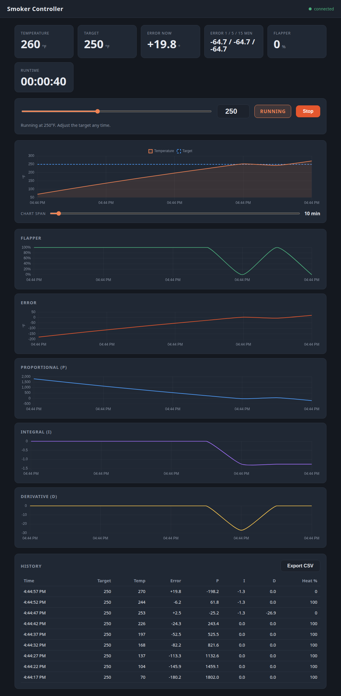

Smoker Controller
=================

Turns a Raspberry Pi into a web-enabled smoker controller.

This PID controller is a little different than others available. It does not use any fans. Instead it uses the natural draft of the smoker to control the temperature. I had a smoker custom built by Lonnie Smith of [Bubba Grills](http://bubbagrills.net) and added a six inch servo controlled flapper to the top of a custom short exhaust over the center of the firebox. Controlling this flapper from completely closed to open gives me about 75F degrees of control. A thermocouple reads the temperature wherever it's placed in the smoker and this custom PID software holds the temperature within a few degrees.

A Word about Fire Management
----------------------------

Fire Management is the most important part of any stick smoker. The operator controls the temperature by the size of the fire, and the amount of oxygen available through the firebox door and dampers. With this controller, the operator has a little more leeway and a little less work. Instead of choking the fire out to cool it using dampers, which creates white smoke, the controller shunts some of that heat from the firebox so it never makes it to the meat. The operator still needs to put wood on the fire every half hour or so, but this takes about 30 seconds without any damper adjustments. Add a couple splits, walk away and know that the temperature will barely change.

## Features

  * PID control holds a single target temperature (adjustable anytime from the web page)
  * handles temperature increases and decreases well - adding wood or opening doors to check meat
  * no limit to runtime - smoke for days if you want
  * view status from any device with a web browser over wifi
  * NIST-linearized conversion for accurate K type thermocouple readings
  * supports MAX31856 and MAX31855 thermocouple boards
  * support for K, J, N, R, S, T, E, or B type thermocouples
  * automatic restart after a power brown-out if the pi reboots mid-smoke
  * simulation mode to test the interface without hardware

## Hardware

### Parts

| Image | Hardware | Description |
| ------| -------- | ----------- |
|  | [Raspberry Pi](https://www.adafruit.com/category/105) | Virtually any Raspberry Pi will work since only a few GPIO pins are being used. |
|  | [MAX31855](https://www.adafruit.com/product/269) or [MAX31856](https://www.adafruit.com/product/3263) | Thermocouple breakout board |
|  | [K-Type Thermocouple](https://www.auberins.com/index.php?main_page=product_info&cPath=20_3&products_id=39) | Any $10 waterproof thermocouple will do just fine |
|  | Servo | Powerful enough to move the flapper, same as those used in RC cars. Waterproof. |
|  | Exhaust Cap Flapper | Just like the ones you see on big-rigs and tractors. Mine is 6 inches in diameter because my exhaust was 5.5 inches. |
|  | Offset Smoker | Custom offset smoker with exhaust added to the fire box |

### Schematic

The pi has three gpio pins connected to the MAX31855 chip. S0 is configured as an input and CS and SCK are outputs. The signal that controls the servo is a gpio output. Since only four gpio pins are in use, any pi can be used for this project. See the [config](https://github.com/jbruce12000/smoker-controller/blob/main/config.py) file for gpio pin configuration.

## Software

### Raspberry PI OS

Download [Raspberry PI OS](https://www.raspberrypi.org/software/). Use the Raspberry Pi Imager tool to install the OS on an SD card. Boot the OS, open a terminal and...

    $ sudo apt-get update
    $ sudo apt-get dist-upgrade
    $ sudo apt-get install python3-virtualenv libevent-dev virtualenv
    $ git clone https://github.com/jbruce12000/smoker-controller
    $ cd smoker-controller
    $ virtualenv -p python3 venv
    $ source venv/bin/activate
    $ pip install --upgrade setuptools
    $ pip install -r requirements.txt

### Servo daemon

The servo is driven through [pigpio](https://abyz.me.uk/rpi/pigpio/) (for accurate, low-jitter pulse timing). Start the pigpio daemon:

    $ sudo systemctl enable pigpiod
    $ sudo systemctl start pigpiod

## Configuration

All parameters are defined in config.py - copy the example and review it.

    $ cp config.py.EXAMPLE config.py

Set the target temperature range, PID parameters, servo pins/range, and thermocouple type for your setup. Here is a [PID Tuning Guide](https://github.com/jbruce12000/smoker-controller/blob/main/docs/pid_tuning.md).

You may want to change **sensor_time_wait**. It's the duty cycle of the entire system, set to five seconds by default. Every N seconds a decision is made about the angle to set on the servo. The angle is changed slowly over the interval to limit current spikes and voltage drops.

To try the web interface without hardware, set `simulate = True` in config.py.

## Usage

### Server Startup

    $ source venv/bin/activate; ./smoker-controller.py

### Autostart Server on Boot

If you want the server to autostart on boot:

    $ /home/pi/smoker-controller/start-on-boot

### Web Access

Click http://127.0.0.1:8081 for local development or use the IP of your Pi and the port defined in config.py (default 8081). Set a target temperature, press Start, and adjust the target any time during the smoke.

The web interface shows the live temperature, target, and error readouts, plus charts of the temperature, flapper position, and PID terms over a selectable time span (2 minutes to the entire session). The flapper readout turns red as an "add wood" reminder when it stays wide open during steady state.

### API

  * `GET /api/stats` - current controller state as JSON
  * `POST /api` with `{"cmd": "run", "setpoint": 250}` - start a smoke
  * `POST /api` with `{"cmd": "stop"}` - stop

### PID tuning

`zn-tuner.py` tunes the PID controller automatically. It runs an open-loop "process reaction curve" test:

1. hold the flapper at a fixed opening (default 40%) until the temperature settles
2. step the flapper open further (default 60%) and record the temperature response
3. fit the process gain `K`, dead time `L`, and time constant `T` to the S-shaped response
4. print PID gains to copy into config.py

The tuner only ever moves the flapper (openness 0-1). It never changes the setpoint, stops your fire, or touches anything else.

Try it on the simulation first:

    $ python3 zn-tuner.py                  # simulated smoker, critically damped
    $ python3 zn-tuner.py --method zn      # aggressive Ziegler-Nichols gains
    $ python3 zn-tuner.py --open1 0.3 --open2 0.5   # pick your own step

Then, with the fire burning, run it on the Pi against the real smoker:

    $ python3 zn-tuner.py --hardware

Keep an eye on it - it holds the flapper open at the step value for a while, and it shuts down above a safety limit (500F / 260C by default).

#### Output

The report shows the fitted reaction curve plus the gains to put in config.py:

    pid_kp = 13.889   # proportional
    pid_ki = 72.000   # integral time, seconds (smaller = stronger integral)
    pid_kd = 0.000    # derivative

Copy those three lines into the PID parameters section of config.py and restart the controller.

By default the tuner prints **critically damped** (lambda) gains, which target no overshoot. Add `--method zn` for the aggressive Ziegler-Nichols gains (~25% overshoot) instead. If you want to fine-tune from there by hand, see [docs/pid_tuning.md](docs/pid_tuning.md).

The tuner follows `config.simulate`: with `simulate = True` it tunes the simulation, with `simulate = False` it tunes the real smoker. Override either way with the flags below.

#### Options

  * `--hardware` - tune the real smoker even if `config.simulate` is True
  * `--simulate` - tune the simulation even if `config.simulate` is False
  * `--open1` / `--open2` - flapper openness for the baseline and the step (default 0.4 / 0.6)
  * `--method` - `critically-damped` (default) or `zn`
  * `--max-temp` - safety shutdown temperature (default 500F / 260C)
  * `--max-wait` - max seconds for a phase to settle before giving up (default 7200)
  * `--settle-window` - seconds of flat temperature before a phase counts as settled (default 300)
  * `--verbose` - debug logging

#### Notes

  * On the simulation, dead time resolves to the sensor sampling floor, so the sim's gains are a lower bound on the real dead time.
  * Rerun the tuner after any change to the firebox, flapper, thermocouple position, or duty cycle (`sensor_time_wait`) - all of those change `K`, `L`, and `T`.
  * The tuner reads the thermocouple just like the controller, so leave `thermocouple_offset` and `temp_scale` set the way you run it normally.

### Running the tests

The controller logic (PID, simulation model, watcher) and the web routes are covered by pytest:

    $ source venv/bin/activate
    $ pip install -r requirements.txt
    $ pytest

The tests run in simulation mode against fakes, so no smoker or Raspberry Pi is needed.

## License

This program is free software: you can redistribute it and/or modify
it under the terms of the GNU General Public License as published by
the Free Software Foundation, either version 3 of the License, or
(at your option) any later version.

This program is distributed in the hope that it will be useful,
but WITHOUT ANY WARRANTY; without even the implied warranty of
MERCHANTABILITY or FITNESS FOR A PARTICULAR PURPOSE.  See the
GNU General Public License for more details.

You should have received a copy of the GNU General Public License
along with this program.  If not, see <http://www.gnu.org/licenses/>.

## Parting Thoughts

You shouldn't build this. It's a lot of work. I had trouble with finding the right connectors for the servo and thermocouple and with keeping wires from melting since they run close to the smoker. But the results are worth it - set the temperature, tend the fire, and hang out with friends.
